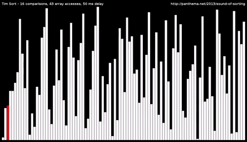

# Timing Timsort

> "Bentley Rules"

In this experiment I implemented and timed some sorting algorithms, including Timsort in C++.

# Resources 

Provided below are a list of resources that helped me complete the experiment. Consult them if you have questions.

1. https://www.youtube.com/watch?v=fHNmRkzxHWs
	- Chandler Carruth "Efficiency with Algorithms, Performance with Data Structures"
2. https://hackernoon.com/timsort-the-fastest-sorting-algorithm-youve-never-heard-of-36b28417f399
	- Timsort algorithm reference.

# Timsort

In this experiment I implemented and timed insertion sort, mergesort, and Timsort on a set of [data.txt](./data.txt) in [sort.cpp](./sort.cpp). 

You can compile with: `g++ -std=c++14 sort.cpp -o sort`
